들어가기에 앞서...   1
  
> 개인적인 견해가 들어갈 수 있으며, 올바른 설명이 아닐 수 있습니다.

# 함수  

- 데이터 타입: 자바스크립트에는 다른 프로그래밍 언어와 달리 명시적인 타입이 없다.
- 변수의 형 변환: 메서드를 이용한 형 변환도 가능하지만, 기본적으로 자동형변환을 한다.
```javascript
var a = 10; //num
  a = 'a';  //string
  console.log(a);  //string
```       

자바스크립트의 변수범위와 호이스팅이 작동하는 원리를 이해하는 것은 필수이다.  
이 두가지는 직관적이면서도 이해하기가 쉽지 않고, 미묘한 차이가 있다.  
***   


## 1.변수범위(Variable Scope)
변수범위는 변수가 존재하는 컨텍스트이다. 어디에서 변수에 접근할 수 있는지, 그 컨텍스트에서 변수에 접근할 수 있는지를 명시적으로 나타냄.
변수는 **지역범위(local scope)** 와 **전역범위(global scope)** 둘 중 하나를 가진다.     
  - _전역 유효범위_ 는 **코드 내 어디서든 변수에 접근**할 수 있음을 의미
  - _지역 유효범위_ 는 **함수 내에서 변수를 정의하고 접근**할 수 있음을 의미
  - 함수 매개변수도 지역변수로 간주, 해당 함수의 본문 내에서 접근가능.
  - 지역변수는 함수내에서 **전역변수보다 높은 우선순위**를 가진다.
  - 지역변수와 전역변수의 이름이 같을 경우 **지역변수가 우선순위가 높다.**    
   

 ```javascript
var name = "global";    // 전역 변수를 선언
function checkscope(){  
  var name = "local"; // 지역 변수를 선언
  console.log(name);  // 전역 변수가 아닌 지역 변수를 사용
}
checkscope();           // 출력 결과: "local"    
 ```    
   

 ```javascript
var name = 'global';     // 전역변수 선언
function checkscope(){   
  name= 'local';         // 전역변수 변경
  name2= 'local';        // 암묵적 새 전역변수 선언
}
checkscope();
console.log(name);       // result: 'local'
console.log(name2);      // result: 'local'
```   
  
중첩 함수에서 내부 함수는 그것이 담긴 함수의 변수에 접근할 수 있다.  
  
 ```javascript
function changeName(name){          // "name"은 지역 변수다
  function inner1(){
    name = name + "-inner1";     
      function inner2(){
        name = name + "-inner2";
    }
    inner2();
  }
  inner1();
  return name;
}
console.log(changeName("Hello"));   // Hello-inner1-inner2
 ```
***
  
### 1-1. 지역변수(함수수준 범위)  
다른 프로그래밍 언어와 달리, 자바스크립트는 블럭수준(block-level)의 범위를 가지고 있지 않다.  
  
대신, 함수수준(function-level)의 범위를 가진다. 함수내에 정의된 변수는 지역범위를 가지게되며, **해당함수와 내부 함수에서만 접근**이 가능하다.    
  

```javascript
var name = 'Chris';

function showName(){
  var name = 'Mac';  // 지역변수; showName() 에서만 접근가능
  console.log(name); // Mac 지역변수
}
console.log(name);   // chris 전역변수
```  

잘못된 예 (블럭수준 범위로 오해할 경우)
```javascript
var name = "Crhis";
// 아래의 if문은 name변수에 대한 지역범위를 생성하지 않는다.
if (name) {
     name = "Mac";
     console.log(name); // Mac  전역 변수
}
// name은 여전히 전역변수이며 if문에서 변경되었다.
console.log(name); // Mac
```
  항상 지역변수를 사용하기 전에 선언을 하도록 해야한다.   

  지역변수를 선언하지 않음으로 인한 문제발생
```javascript
// 지역변수를 var키워드로 선언하지 않았을 경우, 그것은 전역-범위(global-scope)가 된다.
var name = "Michael Jackson";   
  
function showCelebrityName() {
     console.log(name);
}
function showOrdinaryPersonName() {
     name = "Johnny Evers";
     console.log(name);
}
showCelebrityName(); // Michael Jackson
// name 은 지역변수가 아니다. 이것은 전역변수 name을 변경해 버린다.  

showOrdinaryPersonName(); // Johnny Evers
// 이제 전역변수 name은 Johny Evers이다.   

showCelebrityName(); // Johnny Evers   

// 해결책은 지역변수 선언시 var 키워드를 사용하는 것이다. 
function showOrdinaryPersonName() {
     var name = "Johnny Evers"; // 이제 name은 항상 지역변수이며, 전역변수를 덮어쓰지 않는다.
     console.log(name);
}
```  
  
같은 이름의 변수를 전역변수와 지역변수에 각각 부여할 경우, 변수의 범위 특성상 지역변수가 우선순위를 가지게 된다.
```javascript
var name = 'Chris';
function names(){
  var name = 'Mac';
  console.log(name);
}
names();  //Mac
```  


***  
  
  
### 1-2. 전역변수
함수의 외부에서 선언된 모든 변수는 전역범위를 가지며 **브라우저** 에서는 window, **node.js** 에서는 global객체를 가르킨다.  
  
전역변수는 var키워드를 이용하여 선언할 수 있고, var키워드를 사용하지 않고 선언할 수도 있다.
```javascript
var name = 'chris'; // var키워드를 이용한 선언
var name;  
  

name = 'chris';  //var키워드를 이용하지 않은 선언
name;
```
모든 전역변수는 window,global객체와 연결되며 window.Variable , global.Variable이라고 할 수 있다.  
  
브라우저 이용시 window객체를 통해 모든 전역변수에 접근이 가능하다.
```javascript
console.log(window.name); //chris;
console.log("name" in window);
console.log("name" in window);
```  
   
변수가 최초 선언 없이(var키워드를 사용해서) 초기화 되었다면, 이 변수는 자동적으로 **전역컨텍스트** 에 추가된다.  
  
컨텍스트는 함수스코프와 함께 다뤄볼 예정이다.
```javascript
function showMyage(){
  //age는 전역변수
  age = 999;
  console.log(age);
}
showMyAge();
  //age는 전역변수이므로, 이런식으로도 호출될 수 있다.
console.log(age); // 999
```  
  
아래의 firstName은 둘 다 전역범위 입니다. 두번째, firstName은 {}블럭으로 쌓여있지만, 자바스크립트는 블럭단위 범위를 지원하지 않는다는 것을 기억해야한다.
```javascript
var firstName = "Richard";
{
     var firstName = "Bob";
}
console.log(firstName); // Bob
```  
  
다른 예제
```javascript
for (var i=1; i<=10; i++) {
     console.log(i); // 1~10까지 출력
}
// 변수 i는 전역 변수입니다. 그러므로, 아래 함수 호출시 i는 for문에서 실행된 후 마지막 값을 가르키게 됩니다.
function aNumber() {
     console.log(i);
}
aNumber(); // 11
```  
  
setTimeout 변수는 전역 범위에서 실행된다.

setTimeout 안에서 선언된 모든 함수는 전역 범위에서 실행된다. 다음 예제를 주의해서 봐야한다.  
 
```javascript
// setTimeout 함수내에서 사용된 "this"객체는 myObj가 아니라, window객체를 참조.
var highValue = 200;
var constantVal = 2;
var myObj = {
     highValue: 20,
     constantVal: 5,
     calculateIt: function() {
          setTimeout(function() {
               console.log(this.constantVal * this.highValue);
          }, 2000);
     }
}
// 전역변수인 highValue와 constantVal을 사용하여 계산. 200*2.
myObj.calculateIt(); //400
```   

**전역 범위를 오염시키지 마십시오**     
   
자바스크립트 전문가가 되려면, 가급적 전역 범위에 변수를 생성하는것을 피하도록 해야한다.  
  
```javascript
// 다음 두 변수는 전역 범위에 있다.
var firstName, lastName;
function fullName() {
     console.log("Full Name : " + firstName + " " + lastName);
}
```  

다음은, 개선된 코드로서 전역범위를 덜 오염시킨다.
```javascript
// 함수내에 선언함으로서 이것은 지역변수 이다.
function fullName() {
     var firstName = "Michael", lastName = "Jackson";
     console.log("Full Name : " + firstName + " " + lastName);
}
```
위의, 예제에서 fullName() 함수 역시 전역 범위에 있다.  
  
***
## 2. 호이스팅  
호이스팅이란?  
```

hoist: 1. (흔히 밧줄이나 장비를 이용하여) 들어올리다.   
       2. (화물・장애인을 들어올리기 위한) 승강 장치.  
```
무엇을 끌어올리는가?  
  1. 변수'선언'  
  2. 함수'선언'  

호이스팅은 선언과 밀접한 관련이 있다.
자바스크립트 엔진은 코드를 실행하기 전단계로 코드 전반에 걸쳐서 선언된 내용들이 있는지 쭉 흝어보고 발견하는 족족 위로 끌어올린다.
이러한 성질들을 모르는 상태에서 아래의 코드를 보게되면 첫줄부터 오류를 뿜어야 한다.
```javascript
console.log(a());   
console.log(b());   
console.log(c());   
                    
function a() {      
    return 'a';        
}               
var b = function bb(){
    return 'bb';
}
var c = function (){
    return 'c';
}
```   
하지만 자바스크립트는 호이스팅으로 인해
```javascript
function a(){
  return 'a';
}
var b; 
var c;
console.log(a());   
console.log(b());   //함수표현식은 변수 선언부만 호이스팅되고 함수 본문은 호이스팅되지 않기 때문에, 
                          //함수가 정의되기 이전에 함수를 호출하면 오류가 난다. 즉, 의도된 오류이다.
console.log(c());  
  
b = function bb(){
  return 'bb';
}
c = function (){
  return 'c';
}
```  
위와 같이 전환을 마친 상태에서 진행이된다.    
함수 선언은 통째로 올라간 반면에 함수표현식은 선언만 올렸다. 할당은 해당사항이 아니다.   
_함수 선언문_ 은 **그 자체로 하나의 선언**인 반면, _함수표현식_(var b = , var c =)은 **선언과 할당이 한문장 안에 이뤄지는 것으로 분리가 가능**하다.   
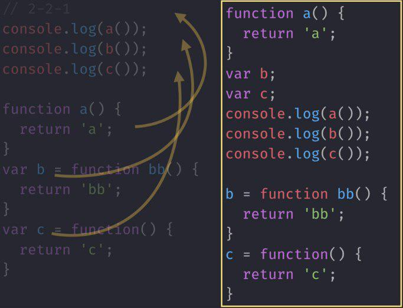  

***
## 3. 함수 선언문과 함수 표현식  
함수선언문과 함수표현식의 차이는 **할당** 여부에 있다.  
할당을 하지 않으면 전체가 호이스팅의 대상이되고, 할당을 하게되면 함수는 그자리에 남아있고 변수만 호이스팅을 하게 된다.  
- 호이스팅이 되느냐에 따라 실무에서 엄청난 차이가 나타난다.    
  
아래의  코드는 협업을 통한 코드를 예로 들어 호이스팅의 중요성을 나타낸다.
```javascript
function sum ( a, b ) {   // 작성자 A
  return a + ' + ' + b + ' = ' + (a+b);
}
sum (1,2);   
  
 /*  ...  중략 ...   */  

function sum ( a, b ) {  // 작성자 B
  return a + b;
}
sum (3,4);    
```  
 위의 sum이라는 함수가 **호이스팅**에 의해 위로 **끌어올려**질 것이며, **캐스캐이딩**의 원칙으로 나중에 호이스팅된 함수가 이전의 함수를 덮어버리게 되며, 작성자 A의 값은 사라지고 작성자 B의 값만 남을 것이다. 함수 선언문은 위에서 아래로 내려가며 읽어내려간다는 방식을 벗어나 가독성 면에서 매우 **좋지 않다.**      
 .    
 .      
 .          
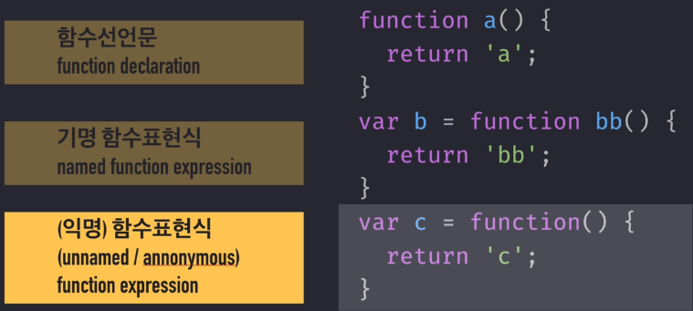
1. 함수선언문(function declaration)  
```javascript
function a(){
    return 'a';
}
```
  
2. 기명 함수표현식(named function expression)
```javascript
//디버깅에 용이하여 많이 사용했지만, 최근 잘 쓰지 않음
var b = function bb(){
    return 'bb';
}  
```  
  
3. (익명)함수표현식(unnamed/annnymous function expression)  
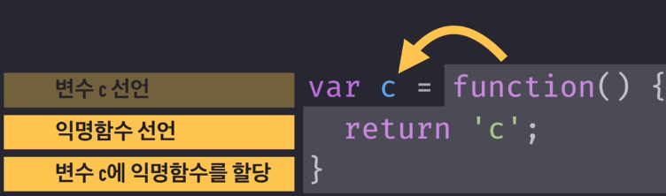
```javascript  
var c =  
function(){ 
    return 'c';
}
```  
- 함수선언문을 이용하면 변수,함수를 찾아야하며 어디 있는지 정확히   
 파악하는데 어려움이 있어서 함수선언문 보다 함수표현식이 안전하고 예측 가능하기 때문에 사용을 권장한다.
***
## 4.함수스코프, 실행컨텍스트  
    
- 스코프는 함수가 정의될때 결정된다.  
- 실행컨텍스트는 함수가 실행될때 생성된다.  
- 실행 컨텍스트에는 호이스팅이 이뤄진 후의 함수 본문내용, this 바인딩 등의 정보가 담긴다.  

  
```javascript
//변수의 유효범위를 생각하며 아래의 코드실행을 예측해보시오.
var a = 1;
  function outer(){
    console.log(a); //1번 결과:1

    function inner (){
      console.log(a); //2번 결과:undefined
      var a =3;
    }
    inner();

    console.log(a); //3번 결과:1
}
outer();
console.log(a);  //4번 결과:1
```
1. 우주같은 빈공간의 전역실행컨텍스트 생성(global), 전역컨텍스트 생성됨, 호이스팅과 this바인딩 등을 처리   
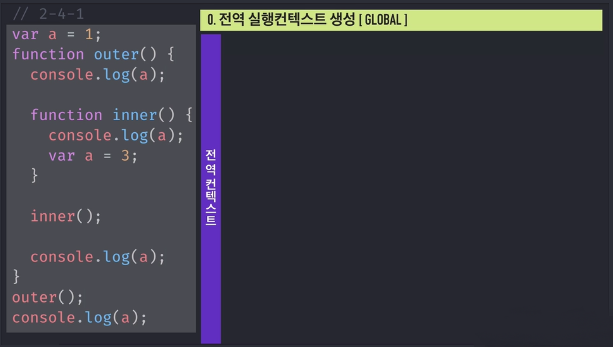    
  
  
    
2. 변수 a 선언   
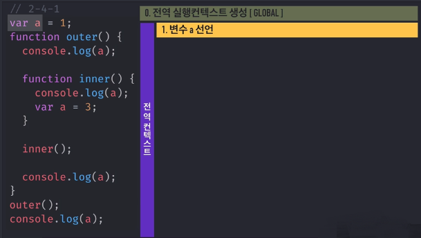    
  
  
   
3. 함수 선언문이 전체를 호이스팅하면서 선언하면서 동시에 선언. 함수가 선언될때 스코프 결정. global > outer     
- 스코프가 결정되어 outer 내부에서 선언된 변수의 유효범위는 outer 내부로 국한되고, outer 외부에서 선언된 변수는 outer 내부에서도 접근이 가능하다.   
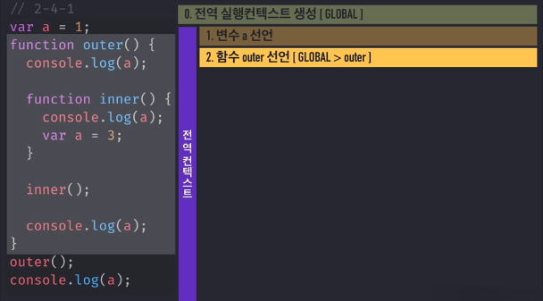    
    

   
4. 변수에 1 할당   
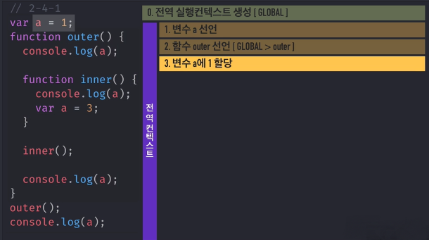    
      

   
5. outer 함수 호출, 함수가 호출될때 실행컨텍스트가 열림   
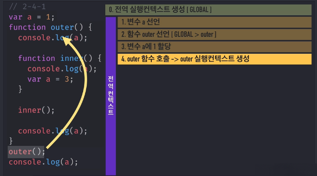      
  
  
  
6. 실행컨텍스트가 생성될때 this 바인딩과 호이스팅이 이뤄짐.    
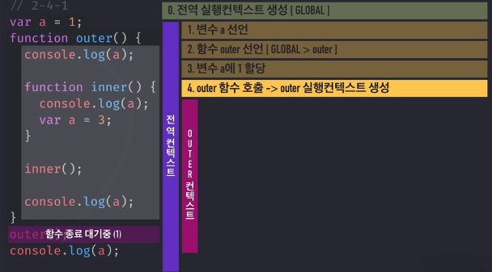   
  
  
  
7. 함수 inner 선언 global > outer > inner 스코프 생성    
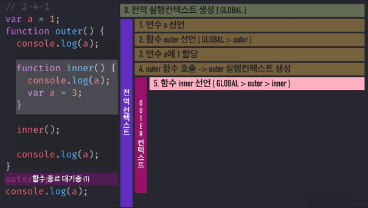   
  
  
  
8. outer 스코프에서 a 탐색하지만 없기때문에 global 스코프에서 a를 재탐색 후 1출력    
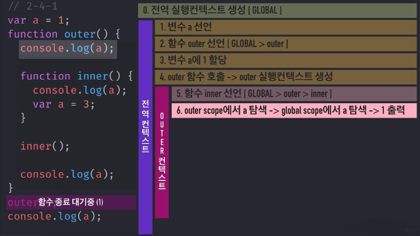     
  
  
  
9. inner 함수 호출, 함수가 실행될때 실행컨텍스트가 열림.  => 이너 실행컨텍스트가 열림.    
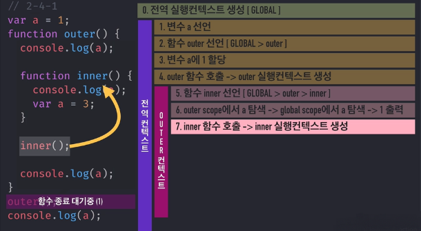   
  
  
  
10. 호이스팅을 함.   
    
   

        
11. 변수 a를 선언   
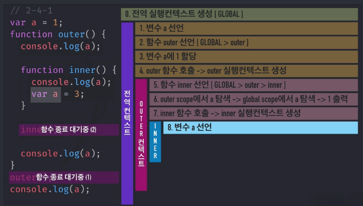   
  
  
  
12. 변수 선언 후 inner scope에서 a 탐색.    
- inner scope는 함수 표현식이기 때문에 아래와 같이 해석한다.     
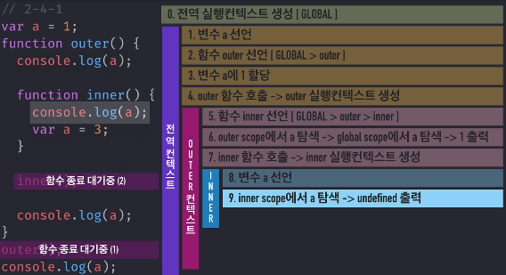   
```javascript
function inner() {
  var a;  // 변수의 선언을 끌어올림 (호이스팅)
  console.log(a);
  a = 3;  // 값은 그자리에 그대로.
  // a에는 값이 지정되지 않아 undefined
  //console.log(a)의 호출 이후에 a에 3이라는 값을 할당.
}
```
또한, 함수 안의 변수는 지역변수이다.  
  
    
        
13.  a에 3 할당  
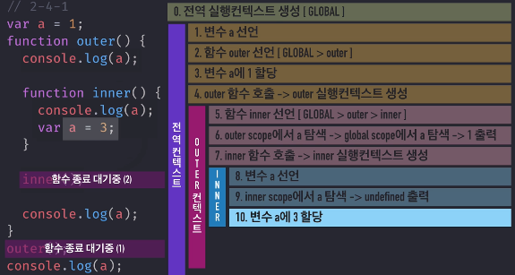    
  
  
    
14. inner 실행컨텍스트 종료  
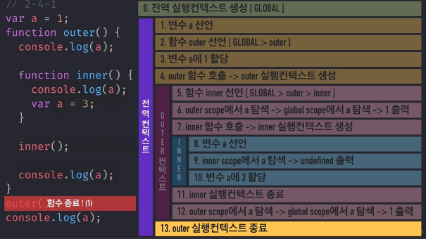  
  
  
    
15. outer scope에서 a를 탐색 => 없으니까 global scope에서 a를 재탐색 => 1을 출력  
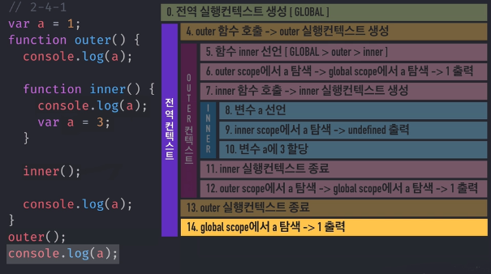  
   

    
16. outer scope가 종료된다.  
  
    
    
    
17. global scope에서 a 탐색 => 1을 출력  
  
  
    
    
18. 전역컨텍스트가 종료된다.  
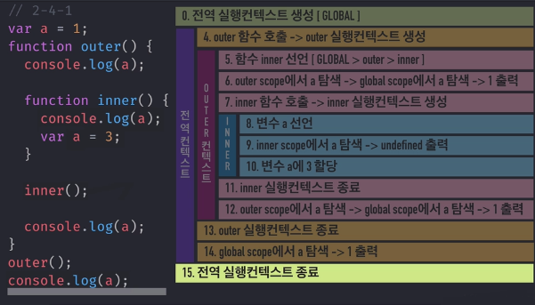    

***
## 5.메서드  
간단히 메서드를 말하면, 무건가의 앞에 " . " (점)이 있는것이다.
함수와 메서드의 차이는 this를 바인딩 하느냐 안하느냐의 차이점이다. 메서드는 this를 바인딩 한다.   
객체란 것은 껍데기를 이루는 말이고 실제 객체를 완성하는 구성요소들은  **프로퍼티** 와 **메소드** 이다.  
***
## 6.콜백함수
> 무언가가 이 콜백함수를 어떤방식인지 언제 호출할진 모르겠지만 언젠가 너에게 돌려줄거야.
콜백함수는 함수형 프로그래밍에서부터 발생한 패러다임이다. 간단히 말해 함수형 프로그래밍은 함수를 인자처럼 사용을 하는 것인데 이는 소수의 전문가들만이 이해하고 사용하는 기법이었지만 지속적으로 누군가에 의해 설명되고 분석되어 오면서 우리가 쉽게 이해하고 사용 할 수 있는 수준이 되었다. 간략히 말해, **함수를 인자로 넘겨 사용하겠다.** 의 의미이다.  
  
```javascript
setInterval (function () ) {
  console.log('1초마다 실행');
}, 1000)
```  
1. 주기함수인 setInterval (/*...중략....*/); 호출
2. 호출한 1번 인자로 **콜백함수**가 들어간다. function (){ console.log('/*중략*/');}  
3. 호출한 2번 인자로 실행할 주기(ms)를 준다.   
4. 1초마다 콜백함수가 실행이 되며 제어권을 setInterval에게 넘겼으며, setInterval이 알아서 실행하고 '나'에게 다시 돌려준다.  
  
콜백함수를 변수로 치환
```javascript
var cb = function (){
  console.log('1초마다 실행');
};
  
    setInverval (cb, 1000);  //MDN: setInverval (callback, milliseconds);
```  

***
## 7.this
자바스크립트에서 this는 함수의 현재 실행 문맥이며, 메소드를 호출한 객체가 저장되어 있는 속성이다.
 - 일반함수의 this => window,global
 - 중첩함수의 this => window,global
 - 이벤트의 this => 이벤트 객체
 - 메서드의 this => 메서드 객체
 - 메서드 내부의 중첩 함수의 this => window,global  
   

***
## 8.클로저
- closuer : 닫혀있음, 폐쇄성, 완결성  
클로저는 함수와 함수가 선언된 어휘적 환경(lexical environment)의 조합이다.  
=> 선언 당시의 환경에 대한 정보를 담는 객체(구성 환경)  
=> 함수 내부에서 생선한 **데이터**와 그 **유효범위**로 인해 발생하는 특수한 **현상,상태**

### 8-1. 클로저

### 8-2. 지역변수 만들기

***

## 9. prototype
자바스크립트는 Class라는 개념이 없다. 그래서 기존의 객체를 복사하여 새로운 객체를 생성하는 프로토타입 기반의 언어이며, 프로토타입 기반의 언어는 객체원형인 프로토타입을 이용하여 새로운 객체를 만들어낸다. 이렇게 생성된 객체 역시 또 다른 객체의 원형이 될 수 있다.  
  
prototype은 자바스크립트의 존재라고 할 수 있으며, 함수와 Class구현에 밀접하다.  
  
   
### 9-1. prototype과 constructor,__proto__

### 9-2. 메소드 상속 및 동작원리

### 9-3. prototype chaining

***
## 10. Class
- Class: 계급, 집단, 집합  
클래스를 통해 프로토타입 기반 상속, 생성자, 인스턴스 메서드 및 정적 메서드를 사용하여 새 개체를 만들 수 있다. 클래스 생성자나 클래스 메서드 내에서 super 개체를 사용하여 부모 클래스 또는 개체에서 같은 생성자 또는 메서드를 호출할 수 있다. 선택적으로 클래스 이름 뒤에 extends 문을 사용하여 새 클래스가 메서드를 상속하는 소스 클래스 또는 개체를 지정한다. **클래스는 ES6부터 지원한다.**

### 10-1. prototype static 메소드 및 static 프로퍼티

### 10-2. class 상속구현
***  
  

출처 및 참고: [인프런_javaScriptFlow](https://www.inflearn.com/course-status-2/),    
[JavaScript Variable Scope and Hoisting Explained](http://javascriptissexy.com/javascript-variable-scope-and-hoisting-explained/)


