# 함수  

- 데이터 타입: 자바스크립트에는 다른 프로그래밍 언어와 달리 명시적인 타입이 없다.
- 변수의 형 변환: 메서드를 이용한 형 변환도 가능하지만, 기본적으로 자동형변환을 한다.
```javascript
var a = 10; //num
  a = 'a';  //string
  console.log(a);  //string
```       

자바스크립트의 변수범위와 호이스팅이 작동하는 원리를 이해하는 것은 필수이다.  
이 두가지는 직관적이면서도 이해하기가 쉽지 않고, 미묘한 차이가 있다.  
***   


## 1.변수범위(Variable Scope)
변수범위는 변수가 존재하는 컨텍스트이다. 어디에서 변수에 접근할 수 있는지, 그 컨텍스트에서 변수에 접근할 수 있는지를 명시적으로 나타냄.
변수는 **지역범위(local scope)** 와 **전역범위(global scope)** 둘 중 하나를 가진다.     
  - _전역 유효범위_ 는 **코드 내 어디서든 변수에 접근**할 수 있음을 의미
  - _지역 유효범위_ 는 **함수 내에서 변수를 정의하고 접근**할 수 있음을 의미
  - 함수 매개변수도 지역변수로 간주, 해당 함수의 본문 내에서 접근가능.
  - 지역변수는 함수내에서 **전역변수보다 높은 우선순위**를 가진다.
  - 지역변수와 전역변수의 이름이 같을 경우 **지역변수가 우선순위가 높다.**    
   

 ```javascript
var name = "global";    // 전역 변수를 선언
function checkscope(){  
  var name = "local"; // 지역 변수를 선언
  console.log(name);  // 전역 변수가 아닌 지역 변수를 사용
}
checkscope();           // 출력 결과: "local"    
 ```    
   

 ```javascript
var name = 'global';     // 전역변수 선언
function checkscope(){   
  name= 'local';         // 전역변수 변경
  name2= 'local';        // 암묵적 새 전역변수 선언
}
checkscope();
console.log(name);       // result: 'local'
console.log(name2);      // result: 'local'
```   
  
중첩 함수에서 내부 함수는 그것이 담긴 함수의 변수에 접근할 수 있다.  
  
 ```javascript
function changeName(name){          // "name"은 지역 변수다
  function inner1(){
    name = name + "-inner1";     
      function inner2(){
        name = name + "-inner2";
    }
    inner2();
  }
  inner1();
  return name;
}
console.log(changeName("Hello"));   // Hello-inner1-inner2
 ```
***
  
### 1-2. 지역변수(함수수준 범위)  
다른 프로그래밍 언어와 달리, 자바스크립트는 블럭수준(block-level)의 범위를 가지고 있지 않다.  
  
대신, 함수수준(function-level)의 범위를 가진다. 함수내에 정의된 변수는 지역범위를 가지게되며, **해당함수와 내부 함수에서만 접근**이 가능하다.    
  

```javascript
var name = 'Chris';

function showName(){
  var name = '';  // 지역변수; showName() 에서만 접근가능
  console.log(name); // 
}
console.log(name);   // chris 전역변수
```  

잘못된 예 (블럭수준 범위로 오해할 경우)
```javascript
var name = "Crhis";
// 아래의 if문은 name변수에 대한 지역범위를 생성하지 않는다.
if (name) {
     name = "Mac";
     console.log(name); // Mac  전역 변수
}
// name은 여전히 전역변수이며 if문에서 변경되었다.
console.log(name); // Mac
```
  항상 지역변수를 사용하기 전에 선언을 하도록 해야한다.   

  지역변수를 선언하지 않음으로 인한 문제발생
```javascript
// 지역변수를 var키워드로 선언하지 않았을 경우, 그것은 전역-범위(global-scope)가 됩니다.
var name = "Michael Jackson";   
  
function showCelebrityName() {
     console.log(name);
}
function showOrdinaryPersonName() {
     name = "Johnny Evers";
     console.log(name);
}
showCelebrityName(); // Michael Jackson
// name 은 지역변수가 아닙니다. 이것은 전역변수 name을 변경해 버립니다.  

showOrdinaryPersonName(); // Johnny Evers
// 이제 전역변수 name은 Johny Evers입니다.   

showCelebrityName(); // Johnny Evers   

// 해결책은 지역변수 선언시 var 키워드를 사용하는 것입니다. 
function showOrdinaryPersonName() {
     var name = "Johnny Evers"; // 이제 name은 항상 지역변수이며, 전역변수를 덮어쓰지 않습니다.
     console.log(name);
}
```  
  
같은 이름의 변수를 전역변수와 지역변수에 각각 부여할 경우, 변수의 범위 특성상 지역변수가 우선순위를 가지게 된다.
```javascript
var name = 'Chris';
function names(){
  var name = 'Mac';
  console.log(name);
}
names();  //Mac
```  


***  
  
  
### 1-3. 전역변수
함수의 외부에서 선언된 모든 변수는 전역범위를 가지며 **브라우저** 에서는 window, **node.js** 에서는 global객체를 가르킨다.  
  
전역변수는 var키워드를 이용하여 선언할 수 있고, var키워드를 사용하지 않고 선언할 수도 있다.
```javascript
var name = 'chris'; // var키워드를 이용한 선언
var name;  
  

name = 'chris';  //var키워드를 이용하지 않은 선언
name;
```
모든 전역변수는 window,global객체와 연결되며 window.Variable , global.Variable이라고 할 수 있다.  
  
브라우저 이용시 window객체를 통해 모든 전역변수에 접근이 가능하다.
```javascript
console.log(window.name); //chris;
console.log("name" in window);
console.log("name" in window);
```  
   
변수가 최초 선언 없이(var키워드를 사용해서) 초기화 되었다면, 이 변수는 자동적으로 **전역컨텍스트** 에 추가된다.  
  
컨텍스트는 함수스코프와 함께 다뤄볼 예정이다.
```javascript
function showMyage(){
  //age는 전역변수
  age = 999;
  console.log(age);
}
showMyAge();
  //age는 전역변수이므로, 이런식으로도 호출될 수 있다.
console.log(age); // 999
```  
  
아래의 firstName은 둘 다 전역범위 입니다. 두번째, firstName은 {}블럭으로 쌓여있지만, 자바스크립트는 블럭단위 범위를 지원하지 않는다는 것을 기억해야한다.
```javascript
var firstName = "Richard";
{
     var firstName = "Bob";
}
console.log(firstName); // Bob
```  
  
다른 예제
```javascript
for (var i=1; i<=10; i++) {
     console.log(i); // 1~10까지 출력
}
// 변수 i는 전역 변수입니다. 그러므로, 아래 함수 호출시 i는 for문에서 실행된 후 마지막 값을 가르키게 됩니다.
function aNumber() {
     console.log(i);
}
aNumber(); // 11
```  
  
setTimeout 변수는 전역 범위에서 실행된다.

setTimeout 안에서 선언된 모든 함수는 전역 범위에서 실행된다. 다음 예제를 주의해서 봐야한다.  
 
```javascript
// setTimeout 함수내에서 사용된 "this"객체는 myObj가 아니라, window객체를 참조.
var highValue = 200;
var constantVal = 2;
var myObj = {
     highValue: 20,
     constantVal: 5,
     calculateIt: function() {
          setTimeout(function() {
               console.log(this.constantVal * this.highValue);
          }, 2000);
     }
}
// 전역변수인 highValue와 constantVal을 사용하여 계산. 200*2.
myObj.calculateIt(); //400
```   

**전역 범위를 오염시키지 마십시오**     
   
자바스크립트 전문가가 되려면, 가급적 전역 범위에 변수를 생성하는것을 피하도록 해야한다.  
  
```javascript
// 다음 두 변수는 전역 범위에 있다.
var firstName, lastName;
function fullName() {
     console.log("Full Name : " + firstName + " " + lastName);
}
```  

다음은, 개선된 코드로서 전역범위를 덜 오염시킨다.
```javascript
// 함수내에 선언함으로서 이것은 지역변수 이다.
function fullName() {
     var firstName = "Michael", lastName = "Jackson";
     console.log("Full Name : " + firstName + " " + lastName);
}
```
위의, 예제에서 fullName() 함수 역시 전역 범위에 있다.  
  
***
## 2.호이스팅  
호이스팅이란?  
```
hoist: 1. (흔히 밧줄이나 장비를 이용하여) 들어올리다.   
       2. (화물・장애인을 들어올리기 위한) 승강 장치.  
```
무엇을 끌어올리는가?  
  1. 변수'선언'  
  2. 함수'선언'  
```javascript
console.log(a());   
console.log(b());   
console.log(c());   
                    
function a() {      
    return 'a';        
}               
var b = function bb(){
    return 'bb';
}
var c = function (){
    return 'c';
}
```


## .함수선언문과 함수표현식  

1. 함수선언문(function declaration)  
```javascript
function a(){
    return 'a';
}
```
  
2. 기명 함수표현식(named function expression)
```javascript
//최근 잘 쓰지 않음
var b = function bb(){
    return 'bb';
}  
```
3. (익명)함수표현식(unnamed/annnymous function expression)
```javascript
    //할당하지 않을경우 전역에 할당됨.   
    //호이스팅에 의해 위로 끌어올려지고 결과가 달라짐.   
    //캐스캐이팅에 의해 나중 함수가 이전의 함수를 덮어씜  
//변수c에 익명함수 할당.   
var c =  //변수 c선언
function(){ // 익명함수 선언
    return 'c';
}
```
- 함수선언문을 이용하면 변수,함수를 찾아야하며 어디 있는지 정확히   
 파악하는데 어려움이 있어, 함수선언문 보다 함수표현식 사용을 권장한다.

## .함수스코프, 실행컨텍스트  
  
실행 컨텍스트에는 호이스팅, this 바인딩 등의 정보가 담긴다.  
  
```javascript
//변수의 유효범위를 생각하며 아래의 코드실행을 예측해보시오.
var a = 1;
  function outer(){
    console.log(a); //1번 결과:1

    function inner (){
      console.log(a); //2번 결과:undefined
      var a =3;
    }
    inner();

    console.log(a); //3번 결과:1
}
outer();
console.log(a);  //4번 결과:1
```

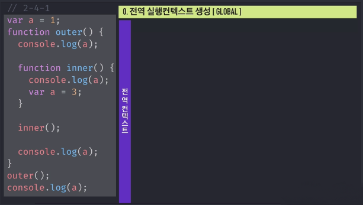  
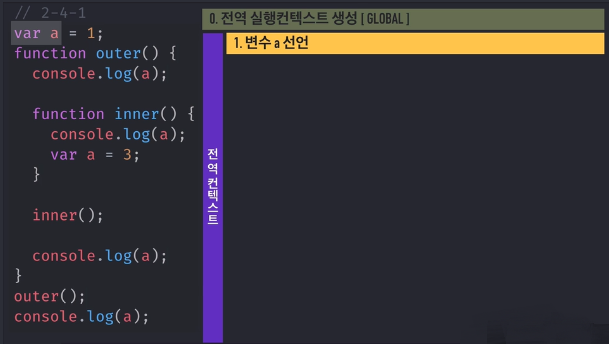  
  
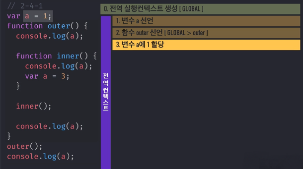  
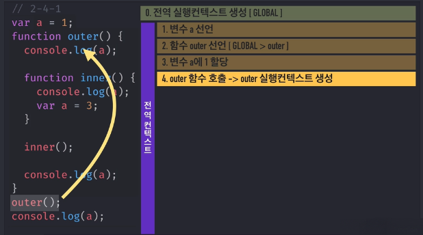  
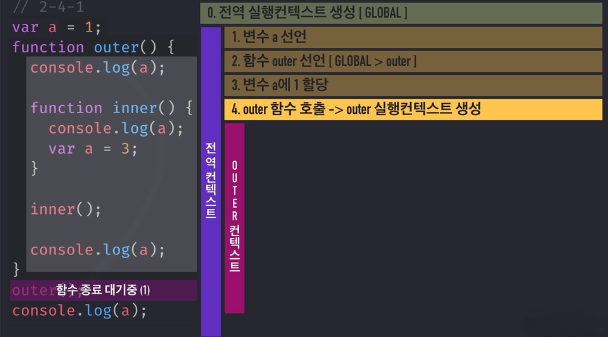  
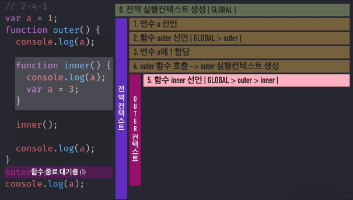  
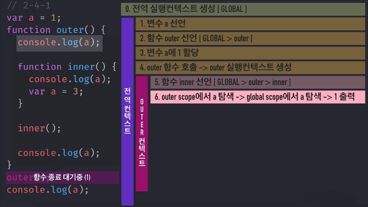  
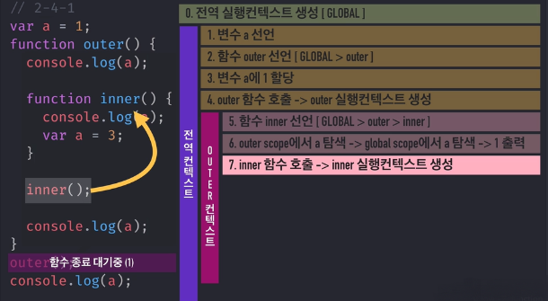  
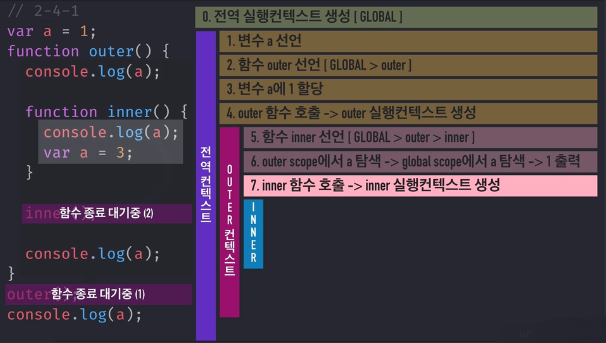  
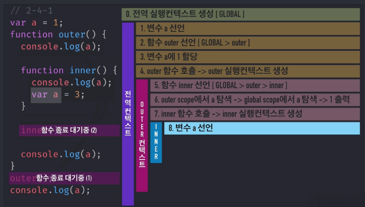  
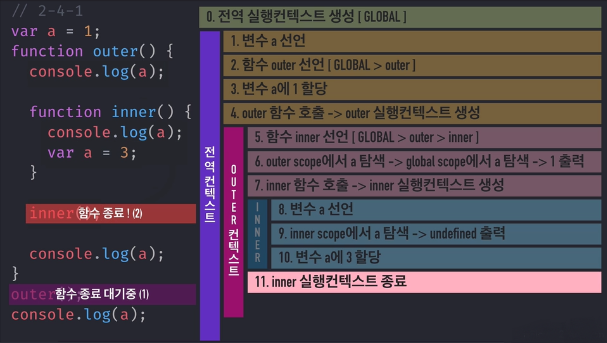  
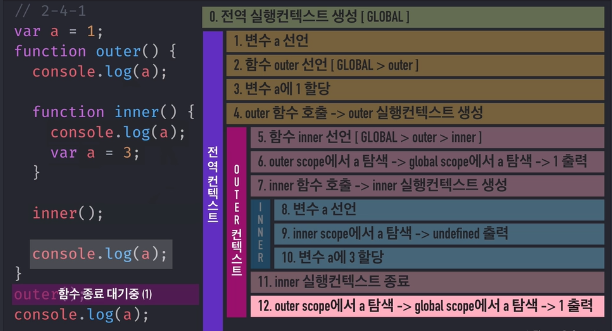  
  
  
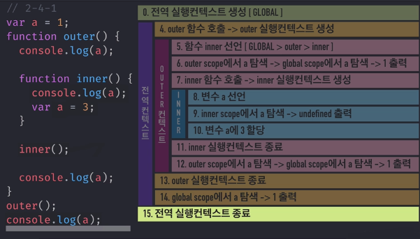  

## .메서드

출처 및 참고: [인프런_javaScriptFlow](https://www.inflearn.com/course-status-2/),    


[자바스크립트의 변수범위와 호이스팅](http://chanlee.github.io/2013/12/10/javascript-variable-scope-and-hoisting/),  
  
[JavaScript Variable Scope and Hoisting Explained](http://javascriptissexy.com/javascript-variable-scope-and-hoisting-explained/)